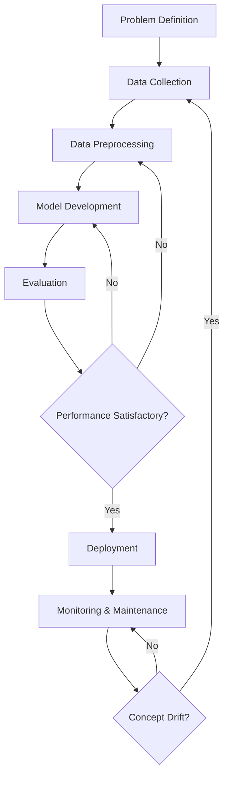

# Week 5 Assignment

## Part 1: Short Answer Questions (30 points)

### 1. Problem Definition (6 points)
**Hypothetical AI Problem:** Predicting Customer Churn for a Telecommunications Company.

**Objectives:**
1.  Reduce revenue loss by identifying at-risk customers early.
2.  Improve customer retention strategies through targeted marketing.
3.  Identify key factors contributing to customer dissatisfaction.

**Stakeholders:**
1.  Marketing Team (to design retention campaigns).
2.  Customer Support Team (to prioritize support for high-risk customers).

**Key Performance Indicator (KPI):**
*   **Churn Rate:** The percentage of subscribers who discontinue their service within a given time period. The goal is to minimize this rate.

### 2. Data Collection & Preprocessing (8 points)
**Data Sources:**
1.  **CRM Database:** Contains customer demographics, subscription plans, and contract details.
2.  **Call Detail Records (CDR):** Contains usage patterns, call duration, and frequency of calls to customer support.

**Potential Bias:**
*   **Selection Bias:** If the historical data predominantly contains customers from a specific region or demographic due to a past marketing campaign, the model may not generalize well to the entire customer base.

**Preprocessing Steps:**
1.  **Handling Missing Data:** Impute missing values (e.g., filling missing age with the median or using a placeholder for categorical variables).
2.  **Encoding Categorical Variables:** Convert text-based categories (e.g., "Plan Type", "Gender") into numerical format using One-Hot Encoding or Label Encoding.
3.  **Feature Scaling:** Normalize or standardize numerical features (e.g., "Monthly Bill", "Data Usage") to ensure they are on a similar scale, which is crucial for many algorithms.

### 3. Model Development (8 points)
**Model Choice:**
*   **Random Forest Classifier:** I would choose Random Forest because it handles non-linear relationships well, is robust to outliers, and provides feature importance scores which are valuable for understanding *why* customers churn. It is also less prone to overfitting compared to a single Decision Tree.

**Data Splitting:**
*   I would split the data into **Training (70%)**, **Validation (15%)**, and **Test (15%)** sets. The training set is for learning, validation for hyperparameter tuning, and the test set for the final unbiased evaluation.

**Hyperparameters to Tune:**
1.  **`n_estimators` (Number of Trees):** Increasing the number of trees generally improves performance and stability but increases computational cost.
2.  **`max_depth`:** Limiting the depth of the trees helps prevent overfitting by ensuring the model doesn't memorize the training data noise.

### 4. Evaluation & Deployment (8 points)
**Evaluation Metrics:**
1.  **Recall:** In churn prediction, False Negatives (failing to identify a churning customer) are costly. High recall ensures we catch most potential churners.
2.  **F1-Score:** This provides a balance between Precision and Recall, which is useful if the class distribution is imbalanced (which is common in churn datasets).

**Concept Drift:**
*   **Definition:** Concept drift occurs when the statistical properties of the target variable change over time (e.g., customer behavior changes due to a new competitor or economic shift), making the model less accurate.
*   **Monitoring:** Monitor performance metrics (Accuracy, F1-Score) on new incoming data in real-time or periodic batches. If performance drops below a threshold, trigger retraining.

**Deployment Challenge:**
*   **Scalability:** If the telecom company has millions of users, generating predictions for all of them daily might be computationally intensive. Ensuring the inference pipeline can handle high throughput with low latency is a key challenge.

---

## Part 2: Case Study Application (40 points)

**Scenario:** A hospital wants an AI system to predict patient readmission risk within 30 days of discharge.

### 1. Problem Scope (5 points)
*   **Problem:** Predict the likelihood of a patient being readmitted to the hospital within 30 days of discharge.
*   **Objectives:**
    1.  Improve patient health outcomes by intervening early.
    2.  Reduce costs associated with preventable readmissions.
    3.  Optimize hospital resource allocation (beds, staff).
*   **Stakeholders:**
    1.  Hospital Administrators.
    2.  Medical Staff (Doctors, Nurses, Case Managers).

### 2. Data Strategy (10 points)
**Data Sources:**
1.  **Electronic Health Records (EHR):** Clinical notes, diagnoses, procedures.
2.  **Admission/Discharge/Transfer (ADT) Systems:** Dates of admission, length of stay.
3.  **Patient Demographics:** Age, gender, insurance type.

**Ethical Concerns:**
1.  **Patient Privacy:** Ensuring compliance with regulations like HIPAA to protect sensitive health information.
2.  **Algorithmic Bias:** The model might perform poorly for underrepresented demographic groups if they are not well-represented in the training data, potentially leading to unequal care.

**Preprocessing Pipeline:**
1.  **Data Cleaning:** Remove duplicate records and correct inconsistent entries.
2.  **Feature Engineering:** Create new features such as "Number of previous admissions in last year", "Comorbidity Index", and "Length of Stay".
3.  **Normalization:** Scale numerical values like lab results and age.
4.  **Imputation:** Handle missing lab values or vitals appropriately (e.g., using clinical norms or mean imputation).

### 3. Model Development (10 points)
> **Note:** A practical implementation of this section using Python and synthetic data is available in the accompanying notebook: `Assignment_Week5_CaseStudy.ipynb`.

**Model Selection:**
*   **XGBoost (Extreme Gradient Boosting):** It is highly effective for structured/tabular data common in healthcare. It handles missing values natively and offers good interpretability (feature importance).

**Confusion Matrix & Metrics (Hypothetical):**
Let's assume a test set of 1000 patients.
*   **Confusion Matrix:**
    *   True Positives (TP): 80 (Correctly predicted readmission)
    *   True Negatives (TN): 850 (Correctly predicted no readmission)
    *   False Positives (FP): 50 (Predicted readmission, but didn't happen)
    *   False Negatives (FN): 20 (Predicted no readmission, but happened)

*   **Precision:** TP / (TP + FP) = 80 / (80 + 50) = 80 / 130 ≈ **0.615**
*   **Recall:** TP / (TP + FN) = 80 / (80 + 20) = 80 / 100 = **0.80**

### 4. Deployment (10 points)
**Integration Steps:**
1.  **API Development:** Wrap the model in a REST API (e.g., using FastAPI or Flask).
2.  **EHR Integration:** Configure the EHR system to send patient data to the API upon discharge planning and receive the risk score.
3.  **UI Display:** Display the risk score and key contributing factors on the clinician's dashboard.

**Compliance:**
*   **HIPAA:** Ensure all data transmission is encrypted (TLS). Use de-identified data for model training where possible. Implement strict access controls and audit logs for who accesses the predictions.

### 5. Optimization (5 points)
**Addressing Overfitting:**
*   **Regularization:** Use L1 (Lasso) or L2 (Ridge) regularization parameters within the XGBoost model to penalize overly complex models. Alternatively, use **Early Stopping** during training to stop when validation error begins to increase.

---

## Part 3: Critical Thinking (20 points)

### 1. Ethics & Bias (10 points)
**Impact of Biased Data:**
If the training data historically reflects disparities in access to care (e.g., certain groups visiting the hospital less frequently due to cost), the model might underestimate the risk for these groups. This could lead to them not receiving necessary preventative interventions, exacerbating health inequalities.

**Mitigation Strategy:**
*   **Fairness-aware Sampling:** Oversample underrepresented groups in the training data to ensure the model learns their patterns equally well. Additionally, evaluate the model's performance (False Negative Rate) separately for different demographic groups to ensure parity.

### 2. Trade-offs (10 points)
**Interpretability vs. Accuracy:**
In healthcare, **Interpretability** is often prioritized. A "Black Box" model (like a deep neural network) might have slightly higher accuracy, but if a doctor cannot understand *why* a patient is flagged as high risk, they may not trust the prediction or know how to intervene. A simpler, interpretable model (like Logistic Regression or a Decision Tree) might be preferred even if it's slightly less accurate, as it supports clinical decision-making.

**Resource Constraints:**
Limited computational resources would rule out massive Deep Learning models that require expensive GPUs for training and inference. The hospital might need to choose lighter models (like Random Forest or Logistic Regression) that can run on standard servers or edge devices, or rely on cloud-based API solutions if data privacy permits.

---

## Part 4: Reflection & Workflow Diagram (10 points)

### 1. Reflection (5 points)
**Most Challenging Part:**
The most challenging part is often **Data Preprocessing and Feature Engineering**. Real-world data (especially healthcare data) is messy, inconsistent, and often missing. Deciding how to handle missing values and which features to engineer requires deep domain knowledge and significantly impacts model performance.

**Improvement:**
With more time, I would collaborate more closely with domain experts (clinicians) to better understand the data and define more meaningful features. I would also implement a more robust validation strategy, such as temporal cross-validation, to better simulate real-world deployment scenarios.

### 2. Workflow Diagram (5 points)

